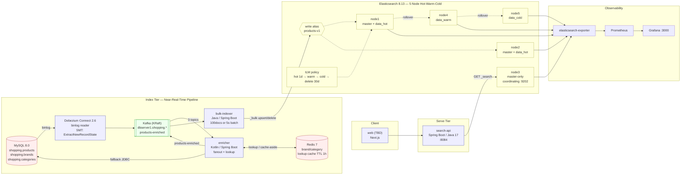

# shopping-search

커머스 상품 검색 플랫폼 PoC. MySQL 을 source-of-truth 로 두고 Debezium CDC → Kafka → enrichment → Elasticsearch 로 흐르는 near-real-time 색인 파이프라인과, BM25 + function score 기반 검색 API 를 포함한다.

## System Architecture



## Components

| Layer      | Component        | Tech                          | Path                               |
|------------|------------------|-------------------------------|------------------------------------|
| Source     | MySQL            | 8.0 / utf8mb4                 | [infra/mysql/](infra/mysql/)       |
| CDC        | Debezium Connect | 2.6 / MySqlConnector          | [infra/debezium/](infra/debezium/) |
| Bus        | Kafka (KRaft)    | 7.6.1 single-broker           | [infra/docker-compose.yml](infra/docker-compose.yml) |
| Cache      | Redis            | 7.2-alpine                    | (compose)                          |
| Enrichment | enricher         | Kotlin + Spring Boot 3.3      | [services/indexer/enricher/](services/indexer/enricher/) |
| Bulk       | bulk-indexer     | Java 17 + Spring Boot 3.3     | [services/indexer/bulk-indexer/](services/indexer/bulk-indexer/) |
| Search     | search-api       | Java 17 + Spring Boot 3.3 + co.elastic.clients 8.13 | [services/search-api/](services/search-api/) |
| Store      | Elasticsearch    | 8.13.4 / 5-node hot-warm-cold | [infra/es/](infra/es/)             |
| Metrics    | Prometheus + Grafana | v2.52 / 10.4              | [infra/prometheus/](infra/prometheus/) |

## Indexing Flow

1. Client writes to MySQL (e.g. `UPDATE products SET stock=...`).
2. Debezium tails the binlog and emits row events to `dbserver1.shopping.{products,brands,categories}` via the `ExtractNewRecordState` SMT (after-image only).
3. `enricher` joins `brand_id → brand_name` and `category_id → leaf_path` via Redis cache-aside (1h TTL), falling back to MySQL JDBC. Brand/category CDC events trigger **fanout** — re-enriching every affected product.
4. Enriched document is published to `products-enriched`, keyed by `product_id` so partition order is preserved per key.
5. `bulk-indexer` buffers up to 100 docs or 5 seconds and issues a single `_bulk` upsert/delete against write alias `products-v1`.
6. Alias resolves to the current write index (`products-v1-000001`, …). ILM promotes through hot → warm → cold and eventually deletes.

## Search Flow

```
GET /search?q=나이키&page=1&size=20
  → multi_match(title^2, title.ngram)            [BM25 primary]
  → function_score:
       • sales_count    — log1p × 0.3            [popularity]
       • updated_at     — gauss 7d / 0.5         [freshness decay]
  → filter / post_filter: in_stock=true
  → sort by _score, tie-break on updated_at
```

Response shape: `{ total, page, size, hits: [{ product_id, title, brand, price, score, ... }] }`. See [docs/search-api.md](docs/search-api.md) (local).

## Quick Start

```bash
# 1. Spin up infra (ES 5 nodes + MySQL + Kafka + Debezium + Redis + Prom/Grafana)
./scripts/cluster-up.sh

# 2. Apply ES template + ILM + bootstrap write alias
./scripts/apply-template.sh && ./scripts/apply-ilm.sh && ./scripts/bootstrap-index.sh

# 3. Register Debezium connector (after MySQL is healthy)
./scripts/register-debezium.sh

# 4. Start indexer services on host JVM (Docker memory is tight at 7.75GB)
( cd services && gradle :indexer:enricher:bootRun --no-daemon ) &
( cd services && gradle :indexer:bulk-indexer:bootRun --no-daemon ) &
( cd services && gradle :search-api:bootRun --no-daemon ) &

# 5. Smoke test
curl -s 'http://localhost:8084/search?q=나이키&size=5' | jq
```

## Repository Layout

```
.
├── infra/               # docker-compose + ES/Debezium/MySQL/Prometheus config
│   ├── docker-compose.yml
│   ├── es/              # cluster configs, index templates, ILM policies
│   ├── mysql/           # init.sql, my.cnf (utf8mb4 forcing)
│   ├── debezium/        # connector.json
│   ├── prometheus/      # prometheus.yml
│   └── grafana/
├── scripts/             # cluster-up/down, bootstrap-index, seed-data, observe-*
├── dummy/               # product generator for load testing
└── services/            # JVM-side code (Gradle multi-module)
    ├── indexer/
    │   ├── enricher/       # Kotlin consumer + fanout
    │   └── bulk-indexer/   # Java batch writer
    └── search-api/         # Java search endpoint
```

## Ports

| Service     | Port(s)                | Notes                                   |
|-------------|------------------------|-----------------------------------------|
| ES nodes    | 9200–9204 → host 9200–9204 | 9202 = coordinating (master-only)   |
| Debezium    | 8083                   | Connect REST                            |
| Kafka       | 9092 (internal), 29092 (host) |                                  |
| MySQL       | 3306                   |                                         |
| Redis       | 6379                   |                                         |
| enricher    | 8081                   |                                         |
| bulk-indexer| 8082                   |                                         |
| search-api  | 8084                   | 8083 is taken by Debezium               |
| Prometheus  | 9090                   |                                         |
| Grafana     | 3000                   | admin / admin                           |

## Design Notes

- **Write alias + rollover, not data stream.** CDC upserts need `PUT _doc/{id}` on the same logical index; data streams are append-only. `products-v1` alias points at the current write-index and ILM rollover swaps it.
- **`time.precision.mode: adaptive_time_microseconds`** on the Debezium side still emits `DATETIME(0)` as **millis**, not micros (per column precision). The enricher converts with `Instant.ofEpochMilli`.
- **Heap 512m per ES node.** Docker desktop caps us at 7.75 GB — 5 ES nodes + Kafka + MySQL + Debezium + Redis ≈ 6.2 GB total. JVM indexer services run on host to avoid further pressure.
- **Korean tokenization** is currently `shopping_standard` (standard analyzer) with an `edge_ngram` subfield; nori integration is a follow-up.
